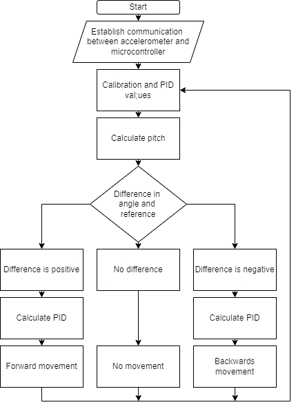
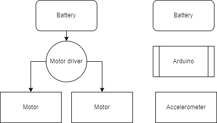

# Self-Balancing Robot

A two-wheeled self-balancing robot built on an Arduino Uno using PID control and an MPU6050 IMU. The robot reads pitch angle via the MPU's onboard Digital Motion Processor (DMP), feeds it into a PID controller, and drives two geared DC motors through an L298N motor driver to maintain upright balance in real time.

---

## Table of Contents

- [Overview](#overview)
- [Hardware](#hardware)
- [Wiring & Pin Assignments](#wiring--pin-assignments)
- [Software & Libraries](#software--libraries)
- [How It Works](#how-it-works)
  - [IMU & DMP](#imu--dmp)
  - [PID Control Loop](#pid-control-loop)
  - [Motor Control](#motor-control)
- [IMU Calibration](#imu-calibration)
- [PID Tuning](#pid-tuning)
- [Sketch Versions](#sketch-versions)
- [Diagrams](#diagrams)
- [Files](#files)

---

## Overview

Self-balancing robots are a classic controls problem — the inverted pendulum. The robot is inherently unstable; without active correction it falls over. The controller must continuously measure the tilt angle and apply corrective motor torque faster than the robot can fall.

This project implements that control loop on an Arduino Uno at a 10ms sample rate (100Hz). The IMU's DMP handles sensor fusion (accelerometer + gyroscope → stable pitch angle), the Arduino runs the PID computation, and the L298N drives the motors at variable PWM.

[Demo Video 1](https://youtu.be/yieLOAEDcKs)

---

## Hardware

| Component | Part | Details |
|-----------|------|---------|
| **Microcontroller** | Arduino Uno | 5V, ATmega328P |
| **IMU** | MPU-6050 | 6-axis accel/gyro, I2C, 5V |
| **Motor Driver** | L298N | Dual H-bridge, 5V logic, up to 12V motor supply |
| **Motors (x2)** | JGA25-370 | Geared DC encoder motor |
| **Motor Supply** | 9V | Applied to motors via L298N |

**JGA25-370 Motor Specs:**

| Parameter | Value |
|-----------|-------|
| Gearbox Ratio | 1:34 |
| No-load Speed | 126 RPM @ 12V (~94.5 RPM @ 9V) |
| Encoder Ticks/Rev | 408 (12 ticks × 34 gear ratio) |
| Wheel Diameter | 73mm (0.073m) |
| Wheel Circumference | 228.6mm (π × 0.073m) |

---

## Wiring & Pin Assignments

```
Arduino Pin   Function
-----------   --------
D3            Left Motor IN1  → L298N IN1
D4            Left Motor IN2  → L298N IN2
D5            Right Motor IN3 → L298N IN3
D6            Right Motor IN4 → L298N IN4
D11           Left Motor PWM  → L298N ENA
D12           Right Motor PWM → L298N ENB
A4 (SDA)      MPU-6050 SDA
A5 (SCL)      MPU-6050 SCL
```

**L298N Power:**
- Logic (pin 16): 5V from Arduino
- Motor supply (pin 8): 9V external
- Ground (pins 4, 13): Common ground with Arduino

**MPU-6050:** VCC → 5V, GND → GND, I2C address `0x68` (AD0 low)

---

## Software & Libraries

| Library | Purpose |
|---------|---------|
| `Wire.h` | I2C communication |
| `I2Cdev.h` | I2C device abstraction (Rowberg) |
| `MPU6050_6Axis_MotionApps20.h` | MPU6050 DMP interface (Rowberg) |
| `PID_v1.h` | PID controller (Brett Beauregard) |
| `avr/wdt.h` | Watchdog timer |
| `math.h` | Floating point math (RAD_TO_DEG) |

Install via Arduino Library Manager or from [i2cdevlib](https://github.com/jrowberg/i2cdevlib).

---

## How It Works

### IMU & DMP

The MPU-6050 contains a built-in **Digital Motion Processor (DMP)** — a dedicated coprocessor that runs sensor fusion onboard, combining accelerometer and gyroscope data to produce stable orientation quaternions. Using the DMP offloads computation from the Arduino and eliminates the gyroscope drift that comes with naive integration.

The DMP outputs quaternions, which are converted to yaw/pitch/roll Euler angles:

```cpp
mpu.dmpGetQuaternion(&q, fifoBuffer);
mpu.dmpGetGravity(&gravity, &q);
mpu.dmpGetYawPitchRoll(ypr, &q, &gravity);
pitch = ypr[1] * RAD_TO_DEG;
```

The robot's balance angle is read from `ypr[1]` (pitch). The FIFO buffer is read and reset each loop cycle to prevent stale data.

### PID Control Loop

The PID controller takes the measured pitch angle as input and outputs a PWM drive value for the motors. The controller runs at a fixed 10ms sample time.

```
setpoint  = trimAngle     (target balance angle, e.g. 2.85°)
input     = pitch          (measured from IMU)
output    = motor PWM      (range: -255 to +255)
```

```cpp
pid.SetMode(AUTOMATIC);
pid.SetOutputLimits(-255, 255);
pid.SetSampleTime(10);  // 10ms = 100Hz
```

**PID Terms (final tuned values):**

| Term | Value | Role |
|------|-------|------|
| kP = 30 | Proportional | Main balance force — responds to current tilt angle |
| kI = 90 | Integral | Corrects steady-state lean (slow drift) |
| kD = 0.5 | Derivative | Damps oscillation ("judder") |

The sign of the output determines motor direction. Positive output → backward drive (corrects forward lean); negative output → forward drive (corrects backward lean).

### Motor Control

Motor direction is set by toggling two digital pins per motor (H-bridge direction control), and speed is set by PWM on the enable pins. The `setPower()` function handles sign resolution:

```cpp
if (pwmLeft < 0)  { forwardLeft();  pwmLeft *= -1; }
else              { backwardLeft();                 }
analogWrite(leftMotorPWMPin, constrain(int(pwmLeft + 0.5), 0, 255));
```

The `constrain()` call clips the PWM value to the valid 0–255 range, and the `+ 0.5` rounds to the nearest integer before truncation.

---

## IMU Calibration

Before running the balance sketch, the MPU-6050 must be calibrated to zero out sensor bias offsets. Uncalibrated offsets cause the DMP to report an incorrect pitch even when the robot is truly level, which shifts the balance point and makes stable tuning impossible.

**Run `MPU6050_calibration.ino` first:**

1. Place the robot on a flat, level surface.
2. Upload `MPU6050_calibration.ino` and open Serial Monitor at 115200 baud.
3. Send any character to begin. Do not move the robot during calibration.
4. The sketch averages 10,000 readings per axis and iteratively converges on offsets within the deadzone thresholds (accel: ±8, gyro: ±1).
5. When finished, it prints the 6 offset values.

Copy the output offsets into the main balance sketch:

```cpp
mpu.setXAccelOffset(-1934);
mpu.setYAccelOffset(994);
mpu.setZAccelOffset(677);
mpu.setXGyroOffset(-21);
mpu.setYGyroOffset(66);
mpu.setZGyroOffset(2);
```

> Calibration offsets are temperature-dependent. If the robot behaves differently after warming up, recalibrate at operating temperature.

---

## PID Tuning

PID tuning was done empirically. The tuning sequence followed standard practice for an inverted pendulum:

**1. Zero I and D, increase P until the robot starts oscillating:**
The robot will rock back and forth with increasing frequency as kP rises. The point just before sustained oscillation is the starting point.

**2. Increase I to correct steady-state lean:**
Without integral action the robot will balance but slowly drift in one direction. kI = 90 was found to correct this without causing wind-up instability.

**3. Add D to dampen oscillation ("judder"):**
The derivative term resists rapid angle changes. Too high causes high-frequency chatter (motor noise); too low allows oscillation. kD = 0.5 was the stable range for this hardware.

**Trim angle (`trimAngle`)** accounts for the robot's center of mass not being perfectly over the wheel axle. A value of `2.85°` was found to be the mechanical balance point — this is where the robot naturally wants to stand when the PID is active.

**Tuning ranges observed across versions:**

| Parameter | Range Tested | Final Value |
|-----------|-------------|-------------|
| kP | 30 – 150 | 30 |
| kI | 90 – 400 | 90 |
| kD | 0.5 – 7.0 | 0.5 |
| trimAngle | -4.3° – 3.125° | 2.85° |

> The wide range between versions reflects different motor driver wiring configurations (L293D vs L298N) and physical hardware changes between builds.

---

## Sketch Versions

The project went through several iterations. Each version is preserved in the repo.

| Sketch | Description |
|--------|-------------|
| `RobotTest.ino` | Early IMU validation — tests MPU-9250 raw output (accel, gyro, mag) and calculates pitch/roll. Used to verify sensor wiring and I2C before integrating PID. |
| `TWRbalance-1.ino` | First full balance attempt. Uses L293D motor driver pinout with encoder inputs wired. High PID gains (kP=150, kI=400, kD=5). trimAngle hardcoded to -4.3°. |
| `TWRbalanceOURS.ino` | Adapted to L298N pinout (pins 3-6, PWM on 11/12). PID gains reduced significantly (kP=35, kI=90, kD=0.65). trimAngle adjusted to 3.125°. |
| `TWRbalanceOURS_v2.ino` | Final version. Adds `moveForward()` / `standStill()` timed state machine in the loop. PWM output for forward motion locked at 100 (fixed throttle). Minor PID gain adjustment (kP=30, kD=0.5). |

---

## Diagrams

### System Flowchart


### Hardware Diagram


### Control Loop


### State Diagram


---

## Files

| File | Description |
|------|-------------|
| `RobotTest.ino` | IMU sensor validation sketch (MPU-9250) |
| `TWRbalance/TWRbalance-1.ino` | First balance sketch (L293D pinout) |
| `TWRbalance/TWRbalanceOURS.ino` | Adapted balance sketch (L298N pinout) |
| `TWRbalance/TWRbalanceOURS_v2.ino` | Final balance sketch with forward motion state machine |
| `MPU6050_calibration/MPU6050_calibration.ino` | IMU offset calibration utility |
| `images/Flowchart.drawio.png` | System flowchart |
| `images/Hardware.drawio.png` | Hardware wiring diagram |
| `images/Loop system.drawio.png` | PID control loop diagram |
| `images/State Diagram.drawio.png` | Robot state diagram |
| `videos/demo1.mp4` | Robot balancing demo |
| `videos/demo2.mp4` | Additional footage |

---

## Demo

https://github.com/komo-248/Self-Balancing-Robot/assets/videos/demo2.mp4
